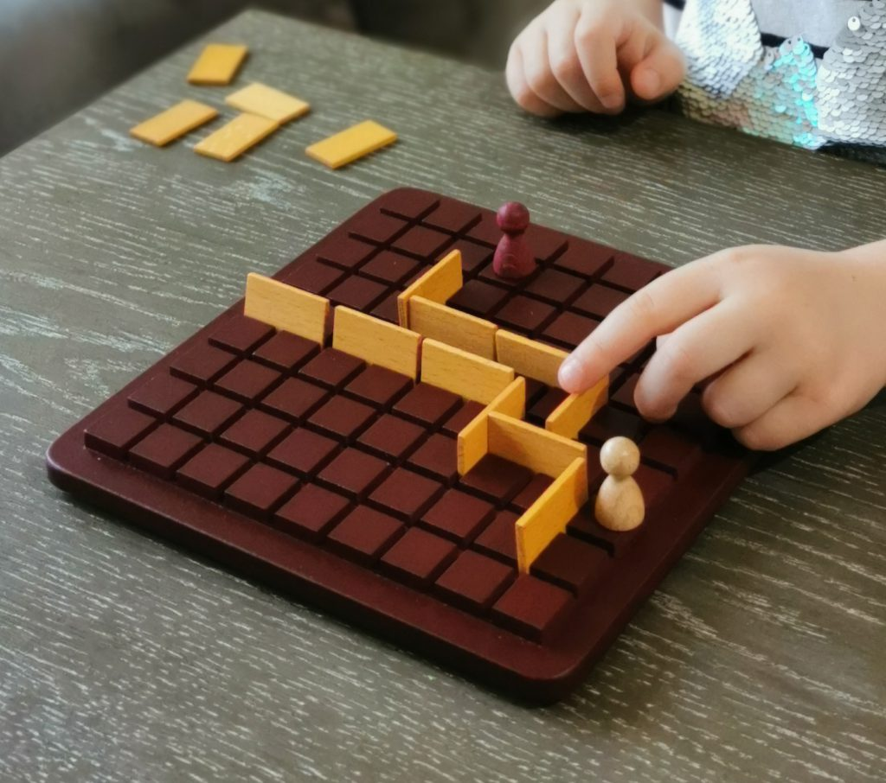

# Projet Quoridor



## Introduction

Bienvenue dans ce dépôt, je suis Ayoub (21061), élève de 2ème bachelier à l'ECAM. Dans le cadre d'un projet en informatique, 
L'objectif est de pouvoir créer un joueur capable de jouer au célèbre jeu `Quoridor`. 

Afin de comprendre au mieux, vous trouvez les explications nécessaires pour comprendre au mieux le [code du jeu](https://github.com/qlurkin/PI2CChampionshipRunner/blob/main/games/quoridor/README.md) ainsi que les [étapes nécessaires pour pouvoir se connecter au serveur hôte du jeu](https://github.com/qlurkin/PI2CChampionshipRunner/blob/main/README.md)

Quoridor est un jeu de société dans lequel les règles sont les suivantes: Deux joueurs se font face sur un plateau. Chaque joueur a la possibilité de jouer un déplacement ou un bloqueur lors de chaque tour. L'objectif est d'arriver dans le camp adverse le plus vite possible. Pour ce faire, il est important d'élaborer certaines stratégies de jeu en réflechissant au mouvement et placement de bloqueurs possible selon l'état du jeu actuel.

C'est pourquoi il est nécessaire d'établir une stratégie afin d'optimiser les chances de vaincre l'adverse.

## Stratégie 

### Déplacement 

Les déplacements sont choisi parmis une liste de valeurs booléenes qui renvoie `True` ou `False` selon l'état du jeu actuel correspondant aux coups qui sont possibles de jouer.

```py
 if player == 0:
            listpathavailable = board[position[0] + 1]
            if 3 in listmoveavailable:
                return down_move(position)
            elif 7 in listmoveavailable:
                return down_jump_move(position)
            elif 4 in listmoveavailable:
                return right_jump_move(position)
            elif 5 in listmoveavailable:
                return left_jump_move(position)
            elif 1 in listmoveavailable and 0 in listmoveavailable:
                fastestmove = verifyblocker(listpathavailable, position[1])
                if fastestmove == "right":
                    return right_move(position)
                else:
                    return left_move(position)
            elif 1 in listmoveavailable:
                return left_move(position)
            elif 0 in listmoveavailable:
                return right_move(position)
            elif 2 in listmoveavailable:
                return up_move(position)
            elif 6 in listmoveavailable:
                return up_jump_move(position)
        else:
            listpathavailable = board[position[0] - 1]
            if 2 in listmoveavailable:
                return up_move(position)
            elif 6 in listmoveavailable:
                return up_jump_move(position)
            elif 4 in listmoveavailable:
                return right_jump_move(position)
            elif 5 in listmoveavailable:
                return left_jump_move(position)
            elif 1 in listmoveavailable and 0 in listmoveavailable:
                fastestmove = verifyblocker(listpathavailable, position[1])
                if fastestmove == "right":
                    return right_move(position)
                else:
                    return left_move(position)
            elif 1 in listmoveavailable:
                return left_move(position)
            elif 0 in listmoveavailable:
                return right_move(position)
            elif 3 in listmoveavailable:
                return down_move(position)
            elif 7 in listmoveavailable:
                return down_jump_move(position)
```

Chaque nombre correspondant à un indice dans une liste comprenant les mouvements possibles.

```py
move_available = callfunction(board, position, opponent_player)
listmoveavailable = get_list_position_true_index(move_available)
```
Voici la liste de déplacements possibles.

```py
def callfunction(board, position, opponent_player):

    listefunction = []
    listefunction.append(right_available(board, position))
    listefunction.append(left_available(board, position))
    listefunction.append(up_available(board, position))
    listefunction.append(down_available(board, position))
    listefunction.append(right_jump_available(board,position,opponent_player))
    listefunction.append(left_jump_available(board,position,opponent_player))
    listefunction.append(up_jump_available(board,position,opponent_player))
    listefunction.append(down_jump_available(board,position,opponent_player))

    return listefunction
```
### Bloqueur 

Pour les bloqueurs, la logique est la même que celle établi pour les déplacements. A partir d'une liste qui renvoie un booléen `True`ou `False`, On place un bloqueur selon le mouvement de l'adversaire et la disponibilité sur le plateau de jeu.

```py
leftorrightavailable = listposblockeravailable(listblockeravailable, board, opponent_position[1], opponent_position[0], listblockeravailableup, listblockeravailabledown)
```

La liste comprenant les placements de bloqueurs possibles :

```py
def listposblockeravailable(listblockeravailable, board, posblocker, posblocker2, listblockeravailableup, listblockeravailabledown):

    result = []
    result.append(blocker_left(listblockeravailableup ,listblockeravailabledown, listblockeravailable, posblocker))
    result.append(blocker_right(listblockeravailableup ,listblockeravailabledown, listblockeravailable, posblocker))
    result.append(blocker_vert_left_up(board, posblocker, posblocker2))
    result.append(blocker_vert_right_up(board, posblocker, posblocker2))
    result.append(blocker_vert_left_down(board, posblocker, posblocker2))
    result.append(blocker_vert_right_down(board, posblocker, posblocker2))

    return result
```

La logique de placement des bloqueurs est la suivante :

`true_indices` étant la liste qui renvoie `True` or `False` pour chaque fonction de la liste de bloqueurs

```py
if 0 in true_indices:    
    index = 0
elif 1 in true_indices:
    index = 1
elif 2 in true_indices:
    index = 2
elif 3 in true_indices:
    index = 3
elif 4 in true_indices:
    index = 4
elif 5 in true_indices:
    index = 5
else:
    play = 'move'
```

## Bibliothèques utilisées 

Afin de parfaire le code du joueur, il est nécessaire d'utiliser certaines bibliothèques dont la plupart s'avèrent indispensables.

`socket`: socket est une bibliothèque qui permet d'établir la connexion entre le client et le serveur au moyen de `l'adresse IP` et du `port`. Il permet au serveur ainsi qu'au client d'envoyer et de recevoir des informations, requêtes ou autres.

`JSON`: Plus connu sous le nom de JavaScript Object Notation, est un langage au format de donnée textuel. Dans le cadre du code établi, il est l'objet des élements envoyés grâce au socket : Les requêtes du serveur ainsi que celles du client sont au format JSON. La transmission de ces informations doit passer par ce langage et sont converti en string afin que chaque parti puisse décoder l'information qui lui parvient.


